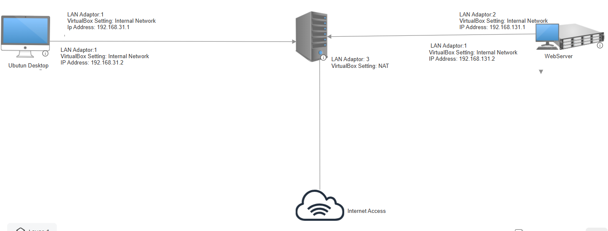

#  Building a Virtual Sandboxed Network Using VirtualBox

This sandboxed network diagram in VirtualBox consists of three core components: Ubuntu Desktop, a Server, and a Web Server. Each component connects to internal networks with private IP addresses and can simulate real-world environments for testing, networking, and server setups.
1. Ubuntu Desktop
* LAN Adaptor: 1
* VirtualBox Setting: Internal Network
* IP Address: 192.168.31.1
* This machine likely acts as a client device for testing connections to the server and webserver.
2. Server (Middle Node)
* LAN Adaptor 1: Internal Network (IP: 192.168.31.2)
* LAN Adaptor 2: Internal Network (IP: 192.168.131.2)
* LAN Adaptor 3: NAT (for Internet Access)
3. Web Server
* LAN Adaptor: 2
* VirtualBox Setting: Internal Network
* IP Address: 192.168.131.1
* This server hosts a web application or website for testing. The client (Ubuntu Desktop) connects through the server to access it.
Networking Design
* The network is segmented into two internal IP ranges:
* 192.168.31.24 (for Client to Server communication).
* 192.168.131.24 (for Server to WebServer communication).
* The Server functions as a router or gateway between the two networks. It facilitates communication while maintaining isolation.
* The NAT adaptor on the Server allows Internet access.
  
# **Key Learning Outcomes**
* IP Addressing & Subnetting:
Configuring private IP addresses (192.168.31.1) and understanding how devices in different ranges interact.
* Network Bridging & Routing:
Understanding how a server acts as a bridge between two internal networks.
* Server & Client Setup:
Setting up servers, web applications, and testing client connections.
* NAT for Internet Access:
Configuring a NAT network to allow controlled external access without exposing the sandbox environment.
